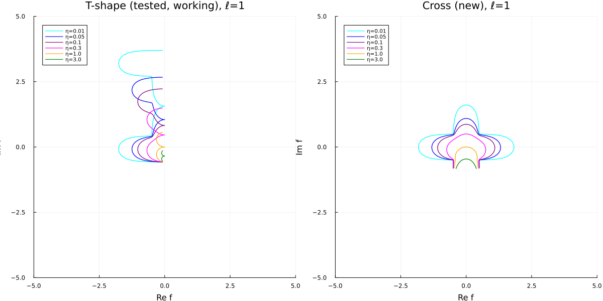

# Conformal Map for the Cross and T-shaped Regions

This document describes the conformal map to the upper half-plane, the extraction of local coordinate maps $f_i$, $g_i$, and the Neumann coefficients entering the plaquette amplitude (see [plaquette_amplitude.md](plaquette_amplitude.md)). The 3-point (T-shaped) case is the primary focus; the 4-point (cross) case is included as a remark.

---

## 1. Schwarz–Christoffel Structure

### 1.1 The T-shaped domain (3-point case)

Capping the bottom arm $A_B$ of the cross $\mathcal{C}_\ell$, the domain becomes:

$$\mathcal{T}_\ell = \Bigl(\mathbb{R} \times [-\tfrac{1}{2}, \tfrac{1}{2}]\Bigr) \;\cup\; \Bigl([-\tfrac{\ell}{2}, \tfrac{\ell}{2}] \times [\tfrac{1}{2}, \infty)\Bigr).$$

This is the full horizontal strip of width $1$ (extending to $\pm\infty$ in both directions), with a vertical arm of width $\ell$ extending upward from its top edge. The boundary condition $|B\rangle$ is imposed on $\partial\mathcal{T}_\ell$.

The boundary $\partial\mathcal{T}_\ell$, traced counterclockwise, consists of:

- Bottom edge: $y = -\frac{1}{2}$, from $x = +\infty$ to $x = -\infty$ (one unbroken straight line),
- Top-left edge: $y = +\frac{1}{2}$, from $x = -\infty$ to $x = -\ell/2$,
- Left edge of vertical arm: $x = -\ell/2$, from $y = \frac{1}{2}$ to $y = +\infty$,
- Right edge of vertical arm: $x = +\ell/2$, from $y = +\infty$ to $y = \frac{1}{2}$,
- Top-right edge: $y = +\frac{1}{2}$, from $x = +\ell/2$ to $x = +\infty$.

The boundary vertices are:

- **2 concave corners** at $(\pm\ell/2,\; +\frac{1}{2})$, interior angle $\frac{3\pi}{2}$,
- **3 arm infinities** ($A_L$, $A_R$, $A_T$), each equivalent to interior angle $0$.

There are no other corners. In particular, the points $(\pm\ell/2,\; -\frac{1}{2})$ are not boundary features — the bottom edge passes through them without turning.

### 1.2 SC derivative

The conformal map $f: \mathbb{H} \to \mathcal{T}_\ell$ has derivative:

$$f^{\prime}(z) = C \;\frac{\sqrt{(z - p_1)(z - p_2)}}{(z - x_L)(z - x_R)(z - x_T)},$$

where $p_1, p_2$ are preimages of the concave corners (SC exponent $+1/2$) and $x_L, x_R, x_T$ are preimages of the arm infinities (simple poles, SC exponent $-1$).

### 1.3 Symmetry and parameter count

The $\mathbb{Z}_2$ symmetry $x \mapsto -x$ and $SL(2,\mathbb{R})$ fix:

$$x_L = -1, \quad x_R = 1, \quad x_T = 0, \qquad p_1 = -p, \quad p_2 = p,$$

with $0 < p < 1$ and the ordering $-1 < -p < 0 < p < 1$ on $\mathbb{R}$. The SC derivative becomes:

$$f^{\prime}(z) = C\;\frac{\sqrt{z^2 - p^2}}{z(z^2 - 1)}.$$

Two unknowns remain: $p$ and $C > 0$.

### 1.4 The cross (4-point case)

For the full cross $\mathcal{C}_\ell$ (four open arms), there are 4 concave corners, no right-angle corners, and 4 arm infinities:

$$f^{\prime}(z) = C\;\frac{\sqrt{(z-p_1)(z-p_2)(z-p_3)(z-p_4)}}{(z-x_L)(z-x_R)(z-x_T)(z-x_B)}.$$

**SL(2,R) gauge.** We fix $x_L = -1$, $x_T = 0$, $x_R = 1$, $x_B = \infty$. This uses all three SL(2,R) degrees of freedom, while respecting the horizontal $\mathbb{Z}_2$ symmetry ($z \to -z$) which swaps $(L \leftrightarrow R)$ and fixes $(T, B)$. The additional reflection symmetries of the cross are anti-holomorphic and don't reduce preimage parameters further.

**Branch of the square root.** Evaluate

$$\sqrt{(q_1^2 - z^2)(z^2 - q_2^2)} \;=\; -i\,\sqrt{z - q_1}\,\sqrt{z + q_1}\,\sqrt{z - q_2}\,\sqrt{z + q_2}$$

factored into its four linear branch-point pieces, using Julia's principal
`sqrt` on each. Each factor's cut runs along $\mathbb{R}$ from the
corresponding branch point to $-\infty$; none of those cuts intersects the
UHP interior, so $f'(z)$ is continuous throughout UHP. A naïve
`sqrt(complex((q_1^2 - z^2)(z^2 - q_2^2)))` would place the cut along the
**positive imaginary axis of $z$** for $|\mathrm{Im}\,z| > q_1$, making
$f'$ discontinuous across the T-arm preimage — wrong for a cross (it
would give $\sigma_L = \sigma_R$, both arms going the same direction).

**Symmetric parametrisation.** Horizontal $\mathbb{Z}_2$ forces corner preimages to pair up: $\{p_1, p_2, p_3, p_4\} = \{q_1, -q_1, q_2, -q_2\}$ for some $0 < q_1 < 1 < q_2$. Ordering on $\mathbb{R}$ going from the B-arm preimage at $+\infty$ past $x_R = 1$ toward $x_T = 0$: $1 < q_2$, then wrapping through the T-arm side: $q_1 < 1$. So

$$f'(z) \;=\; C\;\frac{\sqrt{(q_1^2 - z^2)(z^2 - q_2^2)}}{(z^2 - 1)\,z}.$$

With the principal-branch $\sqrt{\cdot}$ (as used by Julia's `sqrt(complex(...))`) applied to the product $(q_1^2 - z^2)(z^2 - q_2^2)$, the $z=0$ pole has the expected T-arm residue; no extra branch gymnastics needed for the implementation.

**Residue conditions.** At the four arm preimages:

- **$z = +1$ (R arm, $w_R = 1$, $\sigma_R = +1$):** $\operatorname{Res} = +1/\pi$. Arm goes to $\mathrm{Re}\,f \to -\infty$ (LEFT in target, where L/R naming is a convention).
- **$z = -1$ (L arm, $w_L = 1$, $\sigma_L = -1$):** $\operatorname{Res} = -1/\pi$. Arm goes to $\mathrm{Re}\,f \to +\infty$ (RIGHT).
- **$z = 0$ (T arm, $w_T = \ell$, $\sigma_T = -i$):** $\operatorname{Res} = -iC\,q_1 q_2 = -i\ell/\pi$. Arm goes UP.
- **$z = \infty$ (B arm, $w_B = \ell$, $\sigma_B = -i$):** $\operatorname{Res}_\infty$ reads $-i\ell/\pi$ via $z\cdot f'(z) \to -i\ell/\pi$ as $z \to \infty$. Arm goes DOWN.

Opposite $\sigma$ signs at $z = \pm 1$ (vs the same-sign T-shape convention in `src/LocalCoordinates.jl` for its three arms) reflect the factored-branch choice above; the L and R arms of the cross genuinely point in opposite directions.

**Closed-form solution.** From the three residue equations:

- $z = \infty$: $C = \ell/\pi$.
- $z = 0$ (using $C$): $q_1 q_2 = 1$.
- $z = 1$ (using $C$ and $q_2 = 1/q_1$): $(1 - q_1^2)/q_1 = 2/\ell$, a quadratic in $q_1$.

Solving:

$$\boxed{\quad q_1(\ell) = \frac{\sqrt{1+\ell^2}-1}{\ell},\qquad q_2(\ell) = \frac{\sqrt{1+\ell^2}+1}{\ell} = \frac{1}{q_1},\qquad C(\ell) = \frac{\ell}{\pi}.\quad}$$

Limits: $\ell \to 0$ gives $q_1 \to \ell/2, q_2 \to 2/\ell$ (corners collapse with vertical arms); $\ell \to \infty$ gives $q_1, q_2 \to 1$ (corners collapse onto $\pm 1$ with horizontal arms). At $\ell = 1$: $q_1 = \sqrt 2 - 1$, $q_2 = \sqrt 2 + 1$, $C = 1/\pi$.

**Implementation.** `src/SCMap.jl` provides `SCParamsCross` and `compute_sc_params_cross(ℓ)`, plus `fprime_exact_cross(z, sc)`. Tests in `test/test_scmap_cross.jl` verify closed-form values, algebraic invariants ($q_1 q_2 = 1$, $C = \ell/\pi$), limits, the residue conditions, and the horizontal $\mathbb{Z}_2$ ($f'(-z) = -f'(z)$).

**Visual verification.** Figure `figures/cross_geometry_check.png` plots the image of UHP horizontal lines at $\mathrm{Im}(z) \in \{0.01, 0.05, 0.1, 0.3, 1, 3\}$ under $f$ at $\ell = 1$, alongside the analogous T-shape plot for context. The four arms of the cross are visible as four protrusions from a central square region, confirming that the closed-form SC parameters and the factored-branch $f'$ reproduce the intended cross geometry.

**Not needed here — the elliptic structure.** §6 below notes that the cross SC map is uniformised by Jacobi $\operatorname{sn}$. That structure is useful for understanding the large-$n$ asymptotics of Neumann coefficients, but *not* required for the SC parameters themselves: the algebra closes analytically.

---

## 2. Geometric Constraints

### 2.1 Residue conditions

The residue of $f^{\prime}$ at each pole $x_i$ determines the width and direction of the corresponding arm. With the symmetric parametrization:

$$\text{Res}_{z=1}\,f^{\prime}(z) = \frac{C\sqrt{1-p^2}}{2} = \frac{1}{\pi}, \qquad \text{Res}_{z=0}\,f^{\prime}(z) = -Cip = \frac{i\ell}{\pi}.$$

### 2.2 Closed-form solution

From the two residue conditions:

$$C = \frac{2}{\pi\sqrt{1-p^2}}, \qquad Cp = \frac{\ell}{\pi},$$

giving:

$$p(\ell) = \frac{\ell}{\sqrt{4 + \ell^2}}, \qquad C(\ell) = \frac{\sqrt{4 + \ell^2}}{\pi}.$$

Limits: $p \to 0$ as $\ell \to 0$ (vertical arm closes); $p \to 1$ as $\ell \to \infty$.

### 2.3 Alignment

With the $\mathbb{Z}_2$ symmetry and the correct ordering of preimage points on $\mathbb{R}$, there is **no separate alignment condition**. The SC formula automatically produces the T-shape with the bottom edge running straight at $y = -1/2$. The positions of the concave corners at $(\pm\ell/2, +1/2)$ are determined once the strip widths are fixed. Explicitly, $f(\pm p) = \pm\ell/2 + i/2$, which can be verified by integrating $f^{\prime}$ along appropriate paths.

---

## 3. Local Coordinate Maps $f_i$ and $g_i$

### 3.1 Expansion of $f$ near $x_i$

Near each marked point $x_i$, the map $f$ has the form:

$$f(z) = \frac{w_i \sigma_i}{\pi}\log(z - x_i) + \rho_i(z - x_i),$$

where $w_i$ is the arm width, $\sigma_i$ is the arm direction, and $\rho_i$ is **regular**:

$$\rho_i(\zeta) = \sum_{n=0}^{\infty} \rho_i^{(n)}\,\zeta^n.$$

Writing $f^{\prime}(z) = \frac{w_i\sigma_i}{\pi(z-x_i)} + \sum_{n \geq 0} a_i^{(n)}(z-x_i)^n$, we have $\rho_i^{(n)} = a_i^{(n-1)}/n$ for $n \geq 1$.

### 3.2 Computing the Taylor data

The coefficients $a_i^{(n)}$ are obtained by Laurent-expanding $f^{\prime}(z) = C\sqrt{z^2 - p^2}/(z(z^2 - 1))$ around each $x_i$. This involves: partial-fraction expansion of the denominator (product of geometric series around $x_i$), Taylor expansion of the numerator $\sqrt{z^2 - p^2}$ around $x_i$ (polynomial under the square root, expanded via the binomial series), and multiplying the resulting series. All operations are standard truncated power-series arithmetic.

Cost: $O(N^2)$ per marked point for expansion to order $N$.

### 3.3 Definition of $f_i$ and $g_i$

For each open arm $A_i$, the **local coordinate map** is:

$$f_i(z) = \exp\!\Bigl(-\frac{\pi\sigma_i^{\ast}}{w_i}\,f(z)\Bigr),$$

where $\sigma_i^{\ast}$ is chosen so that $f_i$ maps a neighborhood of $x_i$ in $\mathbb{H}$ to a neighborhood of the origin in the upper semidisk $D^+$, with the arm's infinity sent to $\xi_i = 0$. With the convention $\sigma_i^{\ast}\sigma_i = -1$:

$$f_i(z) = \alpha_i(z-x_i)\bigl(1 + e_1^{(i)}(z-x_i) + e_2^{(i)}(z-x_i)^2 + \cdots\bigr), \qquad \alpha_i = e^{-\pi\sigma_i^{\ast}\rho_i^{(0)}/w_i}.$$

The coefficients $e_n^{(i)}$ are obtained by exponentiating the power series $-\frac{\pi\sigma_i^{\ast}}{w_i}\sum_{n \geq 1}\rho_i^{(n)}\zeta^n$.

The inverse $g_i = f_i^{-1}$:

$$g_i(\xi) = x_i + \frac{1}{\alpha_i}\xi\bigl(1 + d_1^{(i)}\xi + d_2^{(i)}\xi^2 + \cdots\bigr),$$

with $d_n^{(i)}$ obtained by series reversion of $f_i$. Cost: $O(N^2)$ per arm.

---

## 4. Derived Geometric Quantities

### 4.1 Jacobian factors

The Jacobian entering the primary amplitude is $|\alpha_i|^{2h_i}$ per arm, where $\alpha_i = f_i^{\prime}(x_i)$ is the leading coefficient of the local map.

### 4.2 Cross-ratio (4-point case)

For the full cross, the cross-ratio $\eta = \frac{(x_R - x_L)(x_T - x_B)}{(x_T - x_L)(x_R - x_B)}$ enters the boundary four-point conformal blocks.

---

## 5. The Functions $F_m^{(i)}$ and the Neumann Coefficients

### 5.1 Construction of $F_m^{(i)}$

Given the Taylor series of $f_i(z)$ around $x_i$, compute $(f_i(z))^{-m}$ as a Laurent series in $(z - x_i)$ (by raising a truncated series to the $-m$th power via the standard recurrence $hg^{\prime} = -m\,h^{\prime}g$), then truncate to the singular part:

$$F_m^{(i)}(z) = (f_i(z))^{-m}\Big|_{\text{sing}} = \alpha_i^{-m}\sum_{n=-m}^{-1}b_n^{(m,i)}\,(z-x_i)^n.$$

This is a polynomial of degree $m$ in $(z - x_i)^{-1}$. Computing $F_m^{(i)}$ for all $m = 1, \ldots, N$ costs $O(N^2)$ per $m$ (by iterative multiplication $f_i^{-m} = f_i^{-(m-1)} \cdot f_i^{-1}$), giving $O(N^3)$ total.

### 5.2 Neumann coefficients $\mathcal{N}^{(i \to j)}_{m,k}$

For each pair $(i, j)$ (including $i = j$), the Neumann coefficient $\mathcal{N}^{(i\to j)}_{m,k}$ is defined by:

$$F_m^{(i)}(g_j(\xi_j)) = \begin{cases} \xi_j^{-m} + \sum_{k \geq 0}\mathcal{N}^{(i\to j)}_{m,k}\;\xi_j^k & (j = i), \\ \sum_{k \geq 0}\mathcal{N}^{(i\to j)}_{m,k}\;\xi_j^k & (j \neq i). \end{cases}$$

These are computed by substituting $z = g_j(\xi_j)$ into $F_m^{(i)}(z)$ (a known polynomial in $(z - x_i)^{-1}$) and expanding in powers of $\xi_j$. For $j \neq i$ this is a composition of a polynomial with a Taylor series; for $j = i$ it reduces to composing the regular part of $(f_i)^{-m}$ with $g_i$.

Cost: $O(N^2)$ per $(m, i, j)$, hence $O(N^3)$ total over all $m$.

### 5.3 Properties

1. **Purely geometric.** The $\mathcal{N}^{(i\to j)}_{m,k}$ depend on $\ell$ but not on the CFT.

2. **Decay.** For large $m$ or $k$, the off-diagonal coefficients ($j \neq i$) decay at a rate controlled by the distance $|x_i - x_j|$ in the UHP.

3. **Symmetry.** The $\mathbb{Z}_2$ of $\mathcal{T}_\ell$ relates $\mathcal{N}^{(L\to \cdot)}$ to $\mathcal{N}^{(R\to\cdot)}$.

### 5.4 Cost summary

For modes up to level $N$:

| Step | Input | Output | Cost |
|---|---|---|---|
| SC parameters | $\ell$ | $p(\ell), C(\ell)$ | Closed form |
| Taylor data $\rho_i^{(n)}$ | SC params | $\rho_i^{(0)}, \ldots, \rho_i^{(N)}$ | $O(N^2)$ per arm |
| Local maps $f_i, g_i$ | $\rho_i^{(n)}$ | $e_n^{(i)}, d_n^{(i)}$ | $O(N^2)$ per arm |
| $F_m^{(i)}$ for all $m$ | $e_n^{(i)}$ | singular parts | $O(N^3)$ per arm |
| Neumann coefficients | $F_m^{(i)}, g_j$ | $\mathcal{N}^{(i\to j)}_{m,k}$ | $O(N^3)$ total |

The dominant cost is $O(N^3)$, matching Neumann coefficient extraction in OSFT.

---

## 6. Remark on the Elliptic Structure

The SC map for the cross (4-point case) is uniformized by Jacobi elliptic functions: $z = \operatorname{sn}(u,k)$ turns the integrand into a meromorphic function on a torus, with aspect ratio $\ell = K^{\prime}(k)/K(k)$ and cross-ratio $\eta = 4k/(1+k)^2$. For the T-shape (3-point case), the SC integrand $\sqrt{z^2 - p^2}/(z(z^2-1))$ also reduces to elliptic integrals.

This is not needed for the computation (the Taylor-expansion algorithm of Sections 3 and 5 is self-contained), but it explains:

1. The Taylor coefficients $\rho_i^{(n)}$ satisfy identities — they are expansion coefficients of elliptic/theta functions at their poles.
2. Their large-$n$ asymptotics (controlling the decay of Neumann coefficients) is governed by the distance to the nearest singularity in the UHP, which in the elliptic uniformization is a half-period.
3. The map $\ell \mapsto \eta(\ell)$ is monotone (for the 4-point case), so the plaquette amplitude is well-defined for all aspect ratios.
